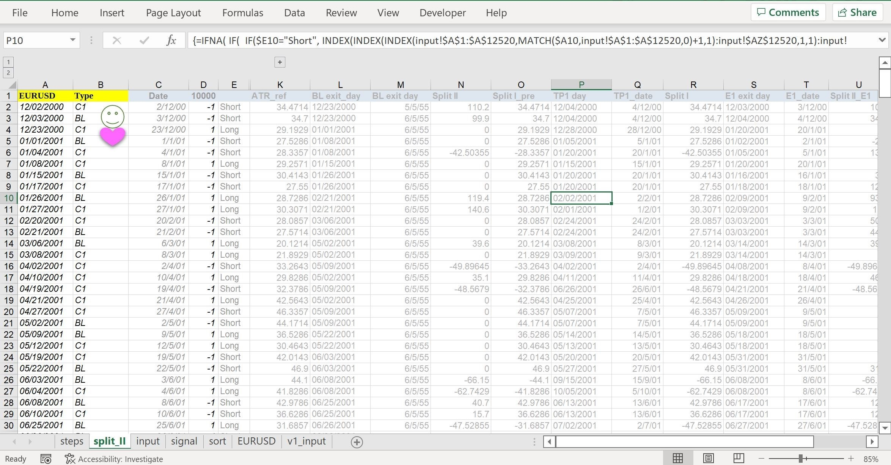

# Project-Deities
Algorithmic trading bots - *Deities* Series
  
# Algorithmic Trading Bot / Expert Advisors: Project Overview
* Developed 3 trading strategies navigating various markets including forex, stock indices, precious metals and Bitcoin (CFDs)
* Backtested over 1000 single-criteria trading systems, and customised over 20 algorithms from existing indicators
* Strategies including trend-following, confluence trading, grid trading (without Martingale)
* Implemented risk management system virtually to avoid potential stoploss hunting or other broker manipulations
* Advanced features including: hedging, equity curve trading, trade filters, dashboard, etc.
* Created a dynamically linked library (.dll) to handle loop-intensive functions on C++ (e.g. real-time optimisations) and return values to main bot
  
## Data collection
### Method 1
Test data can be purchased/downloaded from various data providers such as **Darwinex**, **Tick Data Suite** and **Dukascopy**. They can easily offer 10+ years historical data with precision to each tick (i.e. tick data). Data can be downloaded in various formats, including csv.
### Method 2
Collecting time-series data on MetaTrader 4 is actually free after setting up a demo account with any broker. Using the native `FileWrite` function, data downloaded from MetaQuotes can be exported to a csv file.  
  
Check out my sample code here: [hist_output](https://github.com/urinethrower/Project-Deities/blob/main/hist_output.mq4)  
  
Other than basic open-high-low-close (OHLC), one can also export calculated indicators' values directly - see my **William%R** and **RSI** example in hist_output. Which makes it convenient testing indicator-based strategies.  
  
However, data collected using this method can only be accurate up to 1-Minute bars.
  
## Backtesting single criteria trading systems
Time series data in csv can be easily manipulated with Excel. But in order to compare performances between trading systems, some implementations of VBA might be helpful in calculating metrics like win rate, drawdown, profit factor or average consecutive wins/losses.  
  
Following is a short VBA excerpt from my tester, which shows one of the guard causes I have used to classify trades into different exit types as well as recording the close-out time of each system-entered position.
```
'Stoploss handling
If (EntryPrice - SL_in_pips >= MinLow) Then

Do While k <= EndR.Row                       'loop until SL is reached in any bar within the trade
If (EntryPrice - SL_in_pips >= ThisWorkbook.Sheets("input").Cells(k, 5)) Then
    SL_exit = ThisWorkbook.Sheets("input").Range("A" & k)

    Set SLLookin = Worksheets("signal").UsedRange
    Set SLFound = SLLookin.Find(what:=SL_exit, LookIn:=xlValues, LookAt:=xlPart, MatchCase:=False)
        If Not SLFound Is Nothing Then
            Set SL_Range = SLFound           'record the time
            Exit Do
        End If
End If
k = k + 1
Loop
``` 
And this is my main testing interface in Excel:  

  
It iterates through details of all positions entered by the system, and the information calculated are further manipulated and eventually returns to performance metrics - such as profit factor - for each system tested.
  
## Building the confluence trading system
* After single-criteria systems are shortlisted, selected combinations are used to build the confluence system
* Confluence system was developed and tested on MT4 platform
* Crossed-asset walk-forward and out-of-sample testing was performed to mitigate risk of over-fitting
* A dll file was developed for executing loop-intensive functions (as MQL4 is known to be slower than C++)
* The library was then imported using `#import` fucntion in MQL4
* Below shows the 3 main bodies of my first system (*Demeter 1.0*):  

  
* More features were added afterwards, see below:  
</img>  
  
* Through continuous developments, *Demeter 3.1* (check out my [**Live account 1**](#track-my-live-performance-here)) takes up roughly 1,100 lines of codes and executing properly
* Below shows a snapshot of the bot running on virtual server:  
</img>  
* Check out the backtest report on **Silver/USD** in html by clicking [here](https://htmlpreview.github.io/?https://github.com/urinethrower/Project-Deities/blob/main/StrategyTester.htm) (generated from MT4 strategy tester)
  
## Final thoughts
* Algorithmic trading is superior to manual trading in many ways, such as elimination of psychological factors, human errors, limitation in trading hours, as well as improving the speed and accuracy of executions
* Successful deployment of algorithmic trading bots consists of three pillars: strategy, programming, and reliable server
* While the first 2 factors are rather obvious, the last one is where the devil lies. While your bot doesn't sleep, your server might!
* Debugging on backtests is not enough, one must also lookout for potential problems that could arise during live deployment, and always think two steps ahead
* Consider resilience, memory usage and execution speed while developing
  
## Track my live performance here!
* [Live account 1](https://www.mql5.com/en/signals/1530022?utm_source=www.twitter.com&utm_campaign=en.signals.sharing.desktop&date=1653775200)
* [Live account 2](https://www.mql5.com/en/signals/1350008?utm_source=www.twitter.com&utm_campaign=en.signals.sharing.desktop&date=1653775200)
* [Demo account 1](https://www.mql5.com/en/signals/1546848?utm_source=www.twitter.com&utm_campaign=en.signals.sharing.desktop&date=1653775200)

## Technicals
**Languages used:** MQL4, C++, Excel (VBA)  
**Development Environment:** MetaEditor 4, Visual Studio (MFC), Excel
